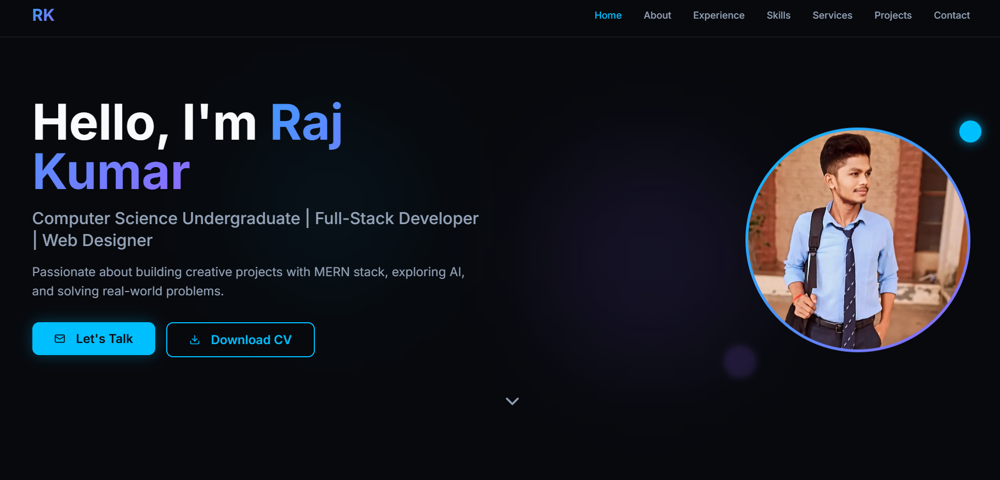

# 🌟 Personal Portfolio

A modern, responsive portfolio website built with React, TypeScript, and Tailwind CSS. Showcasing my projects, skills, and experience as a Full-Stack Developer.



## 🚀 Features

- **Modern UI/UX**: Clean and professional design with smooth animations
- **Fully Responsive**: Optimized for all devices (mobile, tablet, desktop)
- **Dark/Light Theme**: Toggle between themes for better user experience
- **Interactive Sections**: 
  - Hero section with animated profile
  - About me with skills showcase
  - Projects portfolio with live demos
  - Contact form with email integration
- **Performance Optimized**: Fast loading times and smooth animations
- **SEO Friendly**: Meta tags and semantic HTML for better search engine visibility

## 🛠️ Tech Stack

- **Frontend Framework**: React 18
- **Language**: TypeScript
- **Styling**: Tailwind CSS
- **UI Components**: shadcn/ui
- **Icons**: Lucide React
- **Build Tool**: Vite
- **Package Manager**: Bun
- **Deployment**: Vercel/Netlify

## 📦 Installation

1. **Clone the repository**
   ```bash
   git clone https://github.com/Rajgupta764/portfolio.git
   cd RAJPORTFOLIO
   ```

2. **Install dependencies**
   ```bash
   bun install
   # or
   npm install
   # or
   yarn install
   ```

3. **Start development server**
   ```bash
   bun run dev
   # or
   npm run dev
   # or
   yarn dev
   ```

4. **Open your browser**
   Navigate to `http://localhost:5173`

## 🏗️ Build for Production

```bash
bun run build
# or
npm run build
# or
yarn build
```

The production-ready files will be in the `dist` folder.

## 📁 Project Structure

```
RAJPORTFOLIO/
├── node_modules/
├── public/
├── src/
│   ├── assets/
│   ├── components/
│   ├── hooks/
│   ├── lib/
│   ├── pages/
│   ├── App.css
│   ├── App.tsx
│   ├── index.css
│   └── main.tsx
├── .gitignore
├── .hintrc
├── bun.lockb
├── components.json
├── eslint.config.js
├── index.html
├── package-lock.json
├── package.json
├── postcss.config.js
├── README.md
├── tailwind.config.ts
├── tsconfig.app.json
├── tsconfig.json
├── tsconfig.node.json
├── vite-env.d.ts
└── vite.config.ts
```

## 🎨 Customization

### Update Personal Information

1. **Hero Section**: Edit `src/components/Hero.tsx`
   - Update name, title, and description
   - Replace profile image in `src/assets/`

2. **About Section**: Edit `src/components/About.tsx`
   - Update bio and skills

3. **Projects**: Edit `src/components/Projects.tsx`
   - Add/remove projects
   - Update project details, images, and links

4. **Contact Information**: Edit `src/components/Contact.tsx`
   - Update email and social media links

### Update Resume

Replace `public/Raj-Resume.pdf` with your own resume file.

### Change Theme Colors

Edit `tailwind.config.js` to customize colors:
```js
theme: {
  extend: {
    colors: {
      'neon-cyan': '#06b6d4',
      'neon-purple': '#a855f7',
      // Add your custom colors
    }
  }
}
```

## 🚀 Deployment

### Deploy to Vercel

1. Push your code to GitHub
2. Import your repository on [Vercel](https://vercel.com)
3. Vercel will automatically detect Vite and deploy

### Deploy to Netlify

1. Push your code to GitHub
2. Import your repository on [Netlify](https://netlify.com)
3. Build command: `npm run build`
4. Publish directory: `dist`

## 📝 Environment Variables

Create a `.env` file in the root directory if you need environment variables:

```env
VITE_EMAIL_SERVICE_ID=your_service_id
VITE_EMAIL_TEMPLATE_ID=your_template_id
VITE_EMAIL_PUBLIC_KEY=your_public_key
```

## 🤝 Contributing

Contributions, issues, and feature requests are welcome! Feel free to check the [issues page](https://github.com/Rajgupta764/portfolio/issues).

## 📄 License

This project is licensed under the MIT License - see the [LICENSE](LICENSE) file for details.

## 👨‍💻 Author

**Raj Kumar**

- GitHub: [@Rajgupta764](https://github.com/Rajgupta764)
- LinkedIn: [raj-kumar-cse](https://linkedin.com/in/raj-kumar-cse)
- Portfolio: [your-portfolio-url.com](https://your-portfolio-url.com)

## 🙏 Acknowledgments

- [shadcn/ui](https://ui.shadcn.com/) for beautiful UI components
- [Lucide](https://lucide.dev/) for amazing icons
- [Tailwind CSS](https://tailwindcss.com/) for utility-first CSS framework

## ⭐ Show Your Support

Give a ⭐️ if you like this project!

---

Made with ❤️ by Raj Kumar